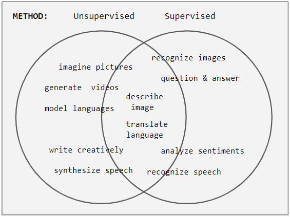

# Domain 1 

Domain 1 covers fundamental AI, ML, and deep learning concepts.

## Tasks

 - Task 1.1 focuses on basic AI concepts and terminology.
 - Task 1.2 explores practical AI use cases and appropriate ML technologies.
 - Task 1.3 describes the ML development lifecycle and AWS services involved.

## Key topics:

- Machine learning models and development
- Data types and learning algorithms
- AI use cases and appropriateness
- ML technologies for specific use cases
- AWS AI and ML services
- ML development pipeline and components
- Model evaluation and metrics

## Key terms

### Artificial Intelligence (AI)

The field of computer science dedicated to solving cognitive problems associated with human intelligence, such as learning, creation, and image recognition.

Goal: To create self-learning systems that derive meaning from data.

Examples: Alexa, ChatGPT, real-time fraud detection, repetitive task automation, pattern recognition, trend forecasting.

### Machine Learning (ML)

A branch of AI that focuses on using data and algorithms to imitate human learning.

Process: Gradually improves accuracy by training on large datasets to identify patterns and make predictions.

Example: Product recommendations.

### Deep Learning

Definition: A type of machine learning model inspired by human brains using layers of neural networks.

Capabilities: Recognizing human speech, objects, and images.

### AI Applications
    
- Healthcare: Reading X-rays and scans, predicting pandemics.
- Manufacturing: Monitoring assembly lines, predicting equipment maintenance.
- Customer Service: Chat and search systems, product recommendations.
- Business Efficiency: Demand forecasting, fraud detection, HR processes.
- Personalized Experiences: Content recommendations, targeted promotions.

### AI Techniques

- Regression Analysis: Predicting future values based on historical data.
- Anomaly Detection: Identifying deviations from expected patterns.
- Computer Vision: Processing images and videos for object identification, facial recognition, and more.
- Natural Language Processing (NLP): Understanding, interpreting, and generating human language.
- Generative AI: Creating original content like stories, images, and music.

### Key Terms

- Inference: A prediction made by an AI model.
- Anomaly: A deviation from the expected pattern.
- Prompt: A request or instruction given to a generative AI model.

By Numiri - Own work, CC BY-SA 4.0, https://commons.wikimedia.org/w/index.php?curid=98615517

## Supervised learning

 A type of machine learning where a model is trained on labeled data to learn the relationship between input data and output labels.

Challenge - Labelling of data requires human effort

Amazon labelling service - Sagework ground turk which uses Amazon mechanical turk 

## Unsupervised learning

- Anamoly detection
- Data collected from sensors
- Recieve inputs with no outputs

## Reinforcement learning 
- Trial and error 
- learning Agent - rewards 
- AWS deep racer, teach to drive on race track
- work with labelled data
- predetermined end goal- exploratory approach - continous validation and improvements.

## Overfitting
- Usually occurs when the validation data is not representative of the training data.
- When a model performs better on training data than on validation data.
- Train with more diverse data
- Sometimes more training can lead to over emphasizing of noise - can lead to overfitting

## Underfitting
- Usually occurs when the training data is not representative of the validation data.
- When a model cannot determine a meaningful relationship between input data.
- Gives inaccurate results for both training and validation data

Sweet spot of training time is required

## Bias

- Disparities in the performance of model with various groups
- Usually occurs with supervised learning models
- Results get skewed with different groups 
- Remove bias inducing parameters and can be removed or improved

Quality of model depends on underlying data quality and quantity.

## Deep learning

- Type of machine learning that uses neural networks, based on the idea of brain
- Software modules called nodes 
- Input layer --> Hidden Layers --> Output layers
- Each layer assigns a weight to each of the feature and information flows in forward direction
- During training the weights of predicted output to actual output is calculated
- Weights are adjusted to minimize the error
- Image classifications and  speech recognition are examples of deep learning
- Computer vision was available but the higher compute requirements were not, which has been available since cloud computing
- Deep learning model would need large amount of data set  
- Cost will be high due to large amount of data and computation

## Machine Learning vs. Deep Learning

| Feature | Machine Learning | Deep Learning |
|---|---|---|
| **Task Type* - | Well-defined tasks with structured and labeled data | Complex tasks that require machines to make sense of unstructured data |
| **Problem Solving* - | Solves problems through statistics and mathematics | Combines statistics and mathematics with neural network architecture |
| **Feature Extraction* - | Manually select and extract features | Models can self-learn using feedback from known error |
| **Cost* - | Less costly | Significantly higher costs |

https://partyrock.aws/

## ML Development lifecycle

**1. Identify Business Goals:**
 - This is the foundational step where you clearly define the problem you want to solve or the question you want to answer using ML.
 - Understanding the business objectives ensures that the ML model aligns with the organization's goals.

**2. Frame ML Problem:**
 - Once you've identified the business goals, you need to frame the problem in terms of a suitable ML task.
 - This might involve classification (e.g., predicting whether an email is spam or not), regression (e.g., forecasting sales), clustering (e.g., grouping customers based on their behavior), or other ML tasks.

**3. Collect Data:**
 - Gathering relevant and high-quality data is crucial for training the ML model.
 - Data sources can include databases, APIs, sensors, or even manual collection.

**4. Prepare Data:**
 - Raw data often needs cleaning, preprocessing, and transformation to make it suitable for ML.
 - This might involve handling missing values, removing outliers, normalizing features, and converting data into a suitable format.

**5. Pre-Process Data:**
 - This step focuses on further preparing the data for modeling.
 - Tasks might include feature engineering (creating new features from existing ones), feature selection (choosing the most relevant features), and data augmentation (increasing the size of the dataset).

**6. Engineer Features:**
 - Feature engineering is a critical step where you create new features that can improve the model's performance.
 - These features should capture relevant information from the data and be informative for the ML task.

**7. Train, Tune, Evaluate:**
 - Here, you train the ML model using the prepared data.
 - You might experiment with different algorithms and hyperparameters to find the best-performing model.
 - Evaluation metrics are used to assess the model's performance on a validation dataset.

**8. Deploy:**
 - Once the model is trained and evaluated, it's ready to be deployed into a production environment.
 - This involves integrating the model into applications or systems where it can be used to make predictions or decisions.

**9. Monitor:**
 - After deployment, the model's performance needs to be monitored to ensure it continues to perform well.
 - This includes tracking metrics, identifying any degradation in performance, and retraining the model if necessary.

The "Prepare Data" and "Process Data" steps are grouped together, as they often involve similar activities but focus on different aspects of data preparation.

- Most ML models are dynamic in nature
- 

