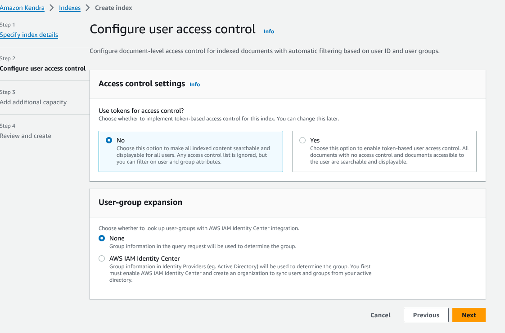

# Amazon Kendra

[Document](https://docs.aws.amazon.com/kendra/latest/dg/what-is-kendra.html)

## What is Kendra?

- **Intelligent Search Service**: Amazon Kendra is an intelligent search service that uses natural language processing (NLP) and machine learning to provide relevant answers to user queries from a variety of data sources.
- **Indexes**: Kendra creates an index that holds the contents of your documents in a searchable format. You can create indexes using the console, AWS CLI, or AWS SDKs.
- **Data Sources**: Kendra can connect to various data repositories (e.g., Amazon S3, Microsoft SharePoint, databases) to index documents automatically. It supports numerous data source types and formats.
- **Direct Document Addition**: If documents aren’t stored in a repository, you can use the BatchPutDocument API to add documents directly to an index.
- **FAQs**: Kendra supports indexing FAQ files stored in Amazon S3 in various formats, such as CSV and JSON, allowing for quick retrieval of commonly asked questions.
- **Search Functionality**: Users can perform searches using natural language queries, keyword searches, or queries with specific criteria for filtering responses. Kendra uses all document information, including metadata, to determine relevance.
- **Customizable Search Experience**: Kendra allows you to create custom fields and use existing document fields to filter and sort search results. You can adjust relevance to fine-tune search results based on field importance.
- **Security**: Kendra integrates with AWS Identity and Access Management (IAM) to manage access to indexes and documents, ensuring search results reflect your organization's security model.
- **Integration with AWS Services**: Amazon Kendra integrates with other AWS services like Amazon Lex, enabling the creation of chatbots that can answer user queries by searching Kendra indexes.

## Getting started with Kendra

## Enriching of Documents

To enrich documents during ingestion with Amazon Kendra, you can use the Custom Document Enrichment feature. Here’s how it works:
- Inline Configurations: You can apply basic logic or inline configurations to modify your document metadata and content during the ingestion process. This might include operations like scrubbing personally identifiable information or adding metadata.
- Lambda Functions: For more advanced data manipulations, you can invoke AWS Lambda functions during the document ingestion. Lambda functions can perform tasks like Optical Character Recognition (OCR) on images, translation of text, or extracting text from images. These functions allow for complex operations that go beyond simple metadata manipulation.

### Data Flow:
 - Configuration: You configure Custom Document Enrichment either when creating or updating your data source or when directly indexing documents into Amazon Kendra.
 - Basic Operations: Amazon Kendra first applies any inline configurations or basic logic you’ve set to alter your data.
 - Advanced Manipulations: If advanced data manipulation is required, Kendra applies Lambda functions to either the original raw documents or the structured parsed documents, depending on your configuration.
 - Ingestion: The modified documents are then ingested into Amazon Kendra.
 - Validation: If the configuration for enrichment is not valid at any point, Amazon Kendra will throw an error, ensuring only correctly configured documents are ingested​

## Quotas

| **Quota Description**                                      | **Default Limit**                   | **Edition**             | **Adjustable** |
|------------------------------------------------------------|-------------------------------------|-------------------------|----------------|
| **Index Quotas**                                           |                                     |                         |                |
| Maximum number of indexes per account                      | 10                                  | Developer, Enterprise   | Yes            |
| Amount of text extracted for an index in a single unit     | 3 GB                                | Developer               | No             |
| Amount of text extracted for an index in a single unit     | 30 GB                               | Enterprise              | Yes            |
| **Data Source Connector Quotas**                           |                                     |                         |                |
| Maximum number of data source connectors per index         | 5                                   | Developer               | No             |
| Maximum number of data source connectors per index         | 50                                  | Enterprise              | Yes            |
| Maximum size of a single document or raw file              | 50 MB                               | Developer, Enterprise   | Yes            |
| Maximum number of S3 prefixes in the access control list   | 100                                 | Developer, Enterprise   | No             |
| **FAQ Quotas**                                             |                                     |                         |                |
| Maximum number of FAQs per index                           | 30                                  | Developer, Enterprise   | Yes            |
| Maximum size of 1 FAQ                                      | 5 MB                                | Developer, Enterprise   | Yes            |
| Maximum number of results returned for FAQ                 | 4                                   | Developer, Enterprise   | Yes            |
| Maximum number of characters allowed for an FAQ question   | 300                                 | Developer, Enterprise   | No             |
| Maximum number of characters in an FAQ answer              | 2000                                | Developer, Enterprise   | No             |
| **Thesaurus Quotas**                                       |                                     |                         |                |
| Maximum number of thesauri per index                       | 1                                   | Developer, Enterprise   | No             |
| Maximum size of a thesaurus file                           | 5 MB                                | Developer, Enterprise   | Yes            |
| Maximum number of synonym rules per thesaurus              | 10,000                              | Developer, Enterprise   | Yes            |
| Maximum number of synonyms per term in all thesauri        | 10                                  | Developer, Enterprise   | No             |
| **Amazon Kendra Experience Quotas**                        |                                     |                         |                |
| Maximum number of Amazon Kendra experiences per index      | 50                                  | Developer, Enterprise   | Yes            |
| **Query and Search Results Quotas**                        |                                     |                         |                |
| Amount of queries per second for an index in a single unit | 0.05 (Developer), 0.1 (Enterprise)  | Developer, Enterprise   | Yes            |
| Maximum number of characters per query text                | 1000                                | Developer, Enterprise   | Yes            |
| Maximum number of search results per query                 | 100                                 | Developer, Enterprise   | Yes            |
| Maximum number of search results per page                  | 100                                 | Developer, Enterprise   | Yes            |
| **Query Suggestions Quotas**                               |                                     |                         |                |
| Maximum number of query suggestions returned per call      | 10                                  | Developer, Enterprise   | Yes            |
| Maximum number of fields/attributes for query suggestions  | 10                                  | Developer, Enterprise   | Yes            |
| Maximum size of a block list text file                     | 2 MB                                | Developer, Enterprise   | Yes            |
| Maximum number of items in a block list                    | 20,000                              | Developer, Enterprise   | Yes            |
| **Document Quotas**                                        |                                     |                         |                |
| Maximum size of a single document or raw file using BatchPutDocument API | 5 MB             | Developer, Enterprise   | Yes            |
| Maximum amount of text extracted from a single document    | 5 MB                                | Developer, Enterprise   | No             |
| Maximum number of custom fields/attributes per index       | 500                                 | Developer, Enterprise   | No             |

## Pricing

Amazon Kendra pricing is based on several factors, including the number of indexes created, the volume of documents indexed, the frequency of queries, and the specific edition of Kendra being used. Here’s an overview of how Amazon Kendra pricing works:

### 1. **Editions**

Amazon Kendra offers two main editions:
- **Developer Edition**: This edition is intended for smaller-scale development and testing purposes. It is less expensive and comes with a lower capacity limit for indexes, documents, and queries.
- **Enterprise Edition**: This edition is designed for production use in larger-scale environments. It offers higher capacity limits and additional features suitable for enterprise-scale applications.

### 2. **Pricing Components**

Amazon Kendra pricing consists of several components, which vary depending on the edition:

- **Indexing**:
  - **Documents Indexed**: The cost of indexing documents depends on the amount of text extracted from the documents. The Developer Edition includes up to 3 GB of extracted text, while the Enterprise Edition includes up to 30 GB. If you exceed these amounts, additional charges apply based on the volume of text processed.
  - **Frequency of Index Synchronization**: When you synchronize an index with a data source, there are additional costs based on the number of times synchronization occurs. More frequent synchronization leads to higher costs.

- **Queries**:
  - **Number of Queries**: Amazon Kendra charges based on the number of queries made to the index. The Developer Edition allows for a limited number of queries (up to approximately 4,000 queries per day or 0.05 queries per second). The Enterprise Edition allows for more queries (up to approximately 8,000 queries per day or 0.1 queries per second). Exceeding these limits will incur additional costs.
  - **Query Suggestions**: If you use Amazon Kendra’s query suggestions feature, there are additional costs based on the number of query suggestions returned.

- **Storage**:
  - **Document Storage**: The storage of documents and indexed content in Amazon Kendra is also a pricing component. The size of the stored data influences the cost, particularly if the amount of data stored exceeds the quota included with the index.

- **Thesauri and FAQs**:
  - **Custom Thesauri**: Creating and using custom thesauri involves additional charges based on the number of synonyms and the size of the thesaurus file.
  - **FAQs**: Adding FAQ documents to an index also has associated costs, particularly if the number of FAQs exceeds the allowed quota.

### 3. **Additional Features and Charges**

- **Amazon Kendra Experiences**: Creating experiences (custom search experiences that are surfaced in different interfaces) incurs additional charges depending on the number and type of experiences created.
- **Data Source Connectors**: Using connectors to ingest data from various repositories can also lead to additional costs, particularly when using connectors that are outside of the free data sources provided.
- **Document Enrichment**: If you utilize Custom Document Enrichment, which involves running AWS Lambda functions to process and enrich documents during ingestion, you will incur additional costs for the compute time and resources used by Lambda.

### 4. **Free Tier**

Amazon Kendra offers a free tier for the Developer Edition, which includes:
- **750 hours of use** for the first 30 days.
- **Up to 5 indexes** with up to 5 data sources each.
- **10,000 documents** or **3 GB of extracted text**.

This free tier is ideal for new users to explore Kendra and develop initial search applications without incurring costs.

### 5. **Region-Based Pricing**

Pricing for Amazon Kendra may vary slightly depending on the AWS region where the service is being used. It is important to check the specific pricing for your region on the AWS pricing page.

### 6. **Monitoring and Controlling Costs**

To manage costs effectively, you can:
- **Monitor Usage**: Use AWS CloudWatch to track usage and spending.
- **Set Budgets and Alerts**: Use AWS Budgets to set usage limits and receive notifications when nearing these limits.
- **Optimize Usage**: Choose the appropriate edition, features, and data sources based on your specific needs and budget.

 
