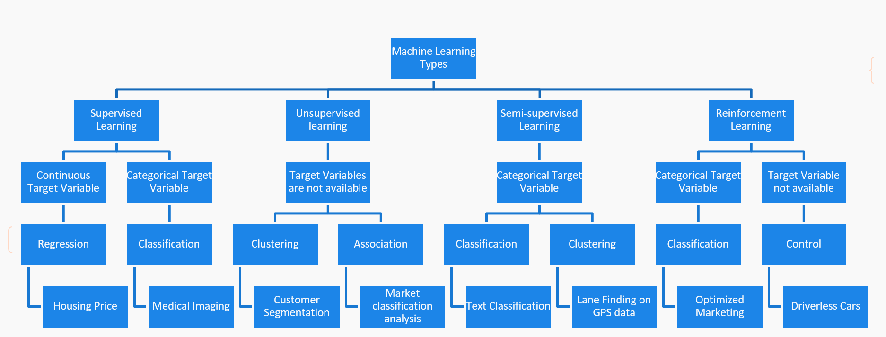
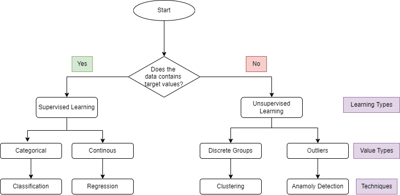
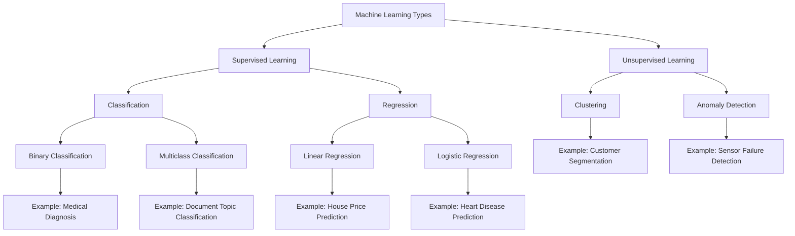

# Practical Uses case for AI

Disclaimer - Some content is generated by AI bots

### Why AI is beneficial?
  - Works continuously without performance decrease
  - Handles repetitive, tedious tasks
  - Decreases employee workload
  - Streamlines business operations
  - Solves complex problems using vast amounts of data
  - Detects patterns and fraud
  - Reduces waste through demand forecasting
  - Improves decision-making and efficiency

### When should AI not be used?
  - High resource consumption for training
  - Costly processing power
  - Frequent model retraining needs
  - When costs outweigh benefits

### Considerations for AI Implementation:
  - Need for model interpretability in decision-making
  - Trade-off between complexity and interpretability
  - Compliance requirements for transparency
  - Rule-based systems as alternatives

### AI vs. Rule-Based Systems:
  - Rule-based systems are deterministic
  - AI models are probabilistic
  - AI learns and adapts over time
  - AI incorporates randomness
  - Deterministic outputs require rule-based systems

## Types of ML

The broad category of Machine learning are

- **Supervised Learning**
- **Unsupervised Learning**
- **Semi-supervised Learning**
- **Reinforcement Learning**

**Supervised Learning**
Supervised learning is a type of machine learning where the model is trained on labeled data. This means the input data is paired with the correct output, allowing the model to learn by comparing its predictions with the actual outcomes. It is further divided into two categories based on the type of target variable:

- **Continuous Target Variable**: When the target variable is continuous (numeric), regression algorithms are used. An example provided is predicting "Housing Price".
- **Categorical Target Variable**: When the target variable is categorical (belongs to a class or category), classification algorithms are employed. An example provided is "Medical Imaging".

**Unsupervised Learning**
Unsupervised learning deals with unlabeled data. The model tries to learn the patterns and structure from the input data without any explicit instructions on what to predict.

- **Target Variables are not available**: This indicates there are no labels for the data. Unsupervised learning can be broken down into:

  - **Clustering**: This technique groups similar data points together. An example is "Customer Segmentation".
  - **Association**: This technique finds rules that describe large portions of the data. An example is "Market classification analysis".

**Semi-supervised Learning**

Semi-supervised learning is a hybrid approach that uses a small amount of labeled data and a large amount of unlabeled data for training. This approach is beneficial when labeling data is expensive or time-consuming.

- **Categorical Target Variable**: Even though the target variable is categorical, not all the data points are labeled.

  - **Classification**: The model learns to classify data based on a mix of labeled and unlabeled data. An example given is "Text Classification".
  - **Clustering**: Similar to unsupervised learning, it also groups data, but with some initial labeled data points to guide the process. An example is "Lane Finding on GPS data".

**Reinforcement Learning**

Reinforcement learning is a type of machine learning where an agent learns to make decisions by performing actions in an environment to achieve maximum cumulative reward. It is unique because it focuses on learning the optimal behavior in a specific context, based on the rewards or punishments received.

- **Categorical Target Variable**: The actions can be seen as making classifications or decisions, which are then rewarded or punished.
  - **Classification**: In reinforcement learning, the decision-making process can be viewed as a classification problem where actions are categorized. An example provided is "Optimized Marketing".

- **Target Variable not available**: This indicates scenarios where the model must control the environment without specific target variables.
  - **Control**: Here, the model controls an environment directly to optimize certain behaviors or outcomes, such as in "Driverless Cars".

###  Use cases

Based on the provided text, here is a table summarizing the types of machine learning, their definitions, and use cases:

| **Learning Type**        | **Definition**                                                                                                                                               | **Use Case**                                                                                                                                                             |
|--------------------------|-------------------------------------------------------------------------------------------------------------------------------------------------------------|--------------------------------------------------------------------------------------------------------------------------------------------------------------------------|
| **Supervised Learning**  | Model is trained with labeled data consisting of input features and corresponding known output labels.                                                       | Predicting whether an individual has a disease based on diagnostic test results (Binary Classification).                                                                 |
| **Classification**       | A type of supervised learning where the target values are categorical (discrete).                                                                           | - **Binary Classification:** Medical diagnosis (disease or not).  - **Multiclass Classification:** Predicting the topic of a document (e.g., religion, politics).  |
| **Regression**           | A type of supervised learning where the target values are continuous (numeric).                                                                              | - **Linear Regression:** Predicting house prices based on features like number of bathrooms and square footage.   - **Logistic Regression:** Predicting heart disease likelihood.|
| **Unsupervised Learning**| Model is trained with input data that does not have corresponding output labels. The goal is to discover patterns or groupings in the data.                 | Segmenting customers into groups by purchase history (Clustering).                                                                                                       |
| **Clustering**           | A type of unsupervised learning where data is grouped into clusters based on similarity.                                                                    | Segmenting customers into groups by purchase history or clickstream activity.                                                                                            |
| **Anomaly Detection**    | A type of unsupervised learning focused on identifying rare items, events, or observations that differ significantly from the majority of the data.          | Detecting failed sensors or identifying medical errors.                                                                                                                  |

This table provides an overview of the main types of machine learning discussed, along with their definitions and practical use cases.

## How to identify what type of ML is best for your use case?

